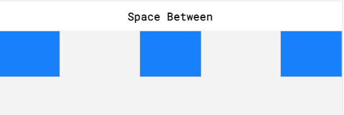

# Flexbox Properties 

### `justify-content:`

- positions items along the main axis (left to right )

```css
div.container {
    justify-content: flex-start;
    justify-content: flex-end;
    justify-content: center;
    justify-content: space-around;
    justify-content: space-between;
}
```



---

### `align-items:`

- positions items along the cross axis (vertical)

```css
div.container {
    align-items: flex-start;
    align-items: flex-end;
    align-items: center;
    align-items: baseline; /* bottom of content will be aligned */
}
```

